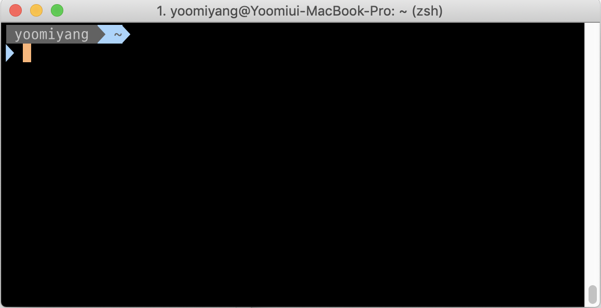

기본쉘인 bash를 사용하는데, flutter에서 PATH 설정해주는걸로 애를 먹다가, 쉘을 zsh로 바꾸게 되었는데 지금 쉘이 너무 이뻐져서 포스팅 ㄱㄱ

위의 글을 보면서 차근히 따라했는데, 잊어버릴까봐 적어놓는거에 목적을 둔다.
<br/><br/><br/>

## ZSH와 Oh My ZSH

bash = windows, zsh = mac 이런 느낌<br/>
Oh My ZSH에는 Z쉘에 플러그인이나 확장팩을 붙일 수 있도록 도와주는 친구

## 좋은점

경로 자동 추론
타이핑 교정
명령어 추천
다양한 플러그인

<br/><br/>

## 설치 방법

### 1. iTerm2 설치 [링크](https://www.iterm2.com/?source=post_page---------------------------)

기본 터미널보다 훨씬 편리한 터미널 프로그램.

### 2. iTerm2 테마 설정: Preferenced -> Profiles -> Colors

옆에 Text탭에서 이따가 글꼴도 바꿀거임.
나의 현재 테마 Pastel(Dark background) 완전 맘에 든다.

### 3. brew 설치

자유-오픈 소스 소프트웨어 패키지 관리 시스템의 하나로서 애플의 macOS 운영 체제의 소프트웨어 설치를 단순하게 만들어준다.
iTerms2에다가 다음 명령어 복붙

```
 /usr/bin/ruby -e "$(curl -fsSL
 https://raw.githubusercontent.com/Homebrew/install/master/install)"
```

### 4. ZSH 설치

```
brew install zsh
```

### 5. Oh my ZSH 설치

```
sh -c "$(curl -fsSL
https://raw.github.com/robbyrussell/oh-my-zsh/master/tools/install.sh)"
```

### 6. agnoster 테마 설치

zshrc 파일을 수정해서 이 테마로 바꿔주면 된다. 이런 테마는 처음본건데, git 상태를 알려준다. 브랜치라든지 커밋유무라든지. 우선 깔아본다.
나는 vi 쓸 줄 모르는 바보라서, nano 에디터를 사용.

```
nano ~/.zshrc
```

실행 후, control+W 키로 검색을 할 수 있다. <br/><br/>

`ZSH_THEME=”robyrussell”` 이 부분을<br/>
`ZSH_THEME="agnoster"` 요로케 바꿔준다.
<br/><br/>

적용하려면 다음 명령어 실행

```
source ~/.zshrc
```

그리고 나면 물음표의 향연을 볼 수 있다. ㅋㅋㅋㅋ 옛날 이메일 생각나넹.
<br/>

### 7. 가독성 좋은 D2 코딩폰트를 설치

[링크](https://github.com/naver/d2codingfont) 다운받아서 최선버전 -> D2CodingAll 폴더에 들어가서 서체 설치를 해주면 된다.
iTerm에서 아까 색상 바꿨던 옆에 탭에서 Preferenced -> Profiles -> Text, change font 버튼을 누르고 D2 글씨체를 선택해주면 물음표가 글씨로 돌아온다.

### 8. Syntax Hightlight 적용

없는 명령어를 사용하면 색상으로 알아볼 수 있게 도와준다.

```
brew install zsh-syntax-highlighting // 설치

source /usr/local/share/zsh-syntax-highlighting/zsh-syntax-highlighting.zsh // 적용
```

### 9. vscode 터미널에도 동일하게 적용

설정에서 shell을 검색해서
Terminal › Integrated › Shell: Osx 에서 settings.json에서 편집하기가 있고 눌러서 수정해준다.
글꼴도 동일하게 D2로 변경해주면 되는데, json 파일에서 바로 가능.

```
"terminal.integrated.shell.osx": "/bin/zsh",
"terminal.integrated.fontFamily": "D2Coding",
```

<br/><br/><br/>

다음은 선택적으로 추가하면 되는 부분인데, 가끔 명령어가 길어서 앞에 명령이 부분이 넘어가버리는게 싫어서 추가했다.
우선 사용자 이름을 짧게 줄이고, 명령어 치는 부분이 새로운 라인으로 시작될 수 있게 해주는 코드이다.

### Option1. 긴 이름 짧게 줄이기

```
nano ~/.zshrc
```

제일 하단에 prompt_context() 함수를 추가해준다.

```
prompt_context() {
  if [[ "$USER" != "$DEFAULT_USER" || -n "$SSH_CLIENT" ]]; then
    prompt_segment black default "%(!.% F{yellow}%}.)$USER"
  fi
}
```

<br/>

### Option2. New Line 적용

```
nano ~/.oh-my-zsh/themes/agnoster.zsh-theme
```

파일을 열고 build_prompt를 찾아서 prompt_newline과 그 아래에 함수를 추가해준다.

```
build_prompt() {
  RETVAL=$?
  prompt_status
  prompt_virtualenv
  prompt_context
  prompt_dir
  prompt_git
  prompt_bzr
  prompt_hg
  prompt_newline //순서 맞춰서 이부분을 추가
  prompt_end
}
```

역시 제일 하단에 다음 그림과 같이 prompt_newline() 부터 코드를 추가해준다. <br/>

```

PROMPT='%{%f%b%k%}$(build_prompt) '

prompt_newline() {
 if [[ -n $CURRENT_BG ]]; then
    echo -n "%{%k%F{$CURRENT_BG}%}$SEGMENT_SEPARATOR
    %{%k%F{blue}%}$SEGMENT_SEPARATOR"
 else
    echo -n "%"
 fi

 echo -n "%"
 CURRENT_BG=''
 
}
```

<br/><br/>
완성된 iTerm

즐거운 코딩하세요 👍🏻
<br/><br/>
