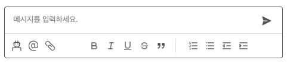
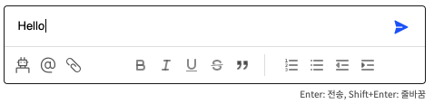
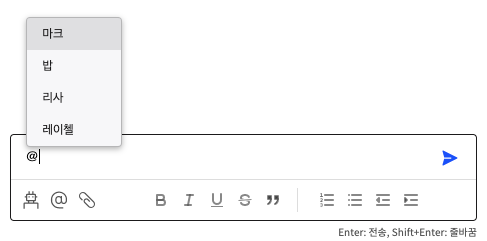
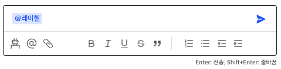
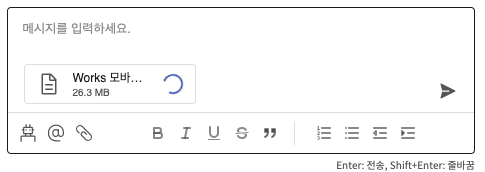
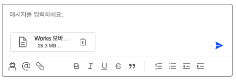
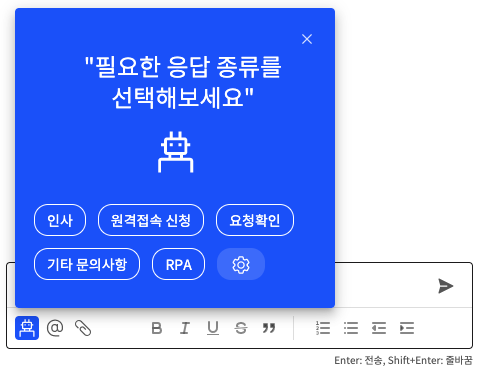

채팅 기능이 있는 웹을 만들면서 까다로웠던 부분 중 하나가 에디터였다. 예전에 간단한 게시판 만들때 사용했던 react-quill을 자연스럽게 사용했는데, 툴바에 이것저것 많은 기능을 넣다보니 복잡해졌다. [Quill 문서](https://quilljs.com/docs/api/) 이용하기에 quill 모듈 넣어서 하는 편이 더 편리해서 react-quill을 지우고, 일반 quill 모듈을 이용해서 개발하게 됐다. 처음에는 각종 에러에 봉착하면서 quill로 변경했는데 하고 보니 잘 한 선택이었다.

그리고 사용한 quill의 버전이 1.3.7이었는데, 특별히 버전 문제인지 꼬여서 그런건지 모르겠으나 'bold', 'italic', 'underline', 'strike', 'blockquote' quill에서 기본적으로 제공해주는 toolbar 옵션에 문제가 있었다. 버튼을 누르면 활성화가 되는데, 취소가 안되는 문제. 이 부분 해결채하는데 애를 먹었는데, quill api를 이용해서 따로 코드를 추가해줬다.

### Quill

기존 Quill 기능에서 toolbar에 따로 추가한 기능.




글씨를 입력하거나 파일을 입력하면 메시지 전송 버튼이 활성화된다.




멘션은 누군가를 특별히 지칭하거나 따로 알람을 주는 기능.
@ 아이콘을 누르거나 입력했을 경우, 관련된 유저 리스트가 뜬다.




파일을 올릴 때, 업로드 중이면 로딩바가 돌고, 업로드 완료 후엔 삭제 버튼 생성.



고객 요청으로 구현한 기능. 특정 버튼을 누르면 리스트가 뜨고, 해당 문구가 바로 에디터창에 입력된다.

<br/><br/>

관련된 코드를 공유한다.

```javascript
import Quill from "quill";
import "quill-mention";
import "quill-mention/dist/quill.mention.css";
```

```javascript
const [quillEl, setQuillEl] = useState(null);
let quill = null;

// quill을 정의하는 부분과 리액트에서 quill을 받는 부분을 분리해서 구현했고,
// quill.on 텍스트 변경 이벤트를 useEffect 안에 넣어서 사용했다.

// bold/italic/underline/strike/blockquote 취소가 되지 않는 에러를 수정하기 위해 추가한 함수
const handleToolbar = (name) => {
    var selection = quill.getSelection();
    if (selection) {
      if (selection.length > 0) {
        if (quill.getFormat(selection.index, selection.length)[name]) {
          quill.format(name, false);
          quill.removeFormat(selection.index, selection.length);
        } else {
          quill.format(name, true);
          quill.formatText(selection.index, selection.length, name, true);
        }
      } else {
        if (quill.getFormat(selection.index)[name]) {
          quill.format(name, false);
        } else {
          quill.format(name, true);
        }
      }
    }
  };

useEffect(() => {
    if (!quill) {
      quill = new Quill("#editor", {
        modules: {
          toolbar: {
            container: "#toolbar",
            handlers: {
              send: () => {},
              bot: () => setOpenDialogBot(!openDialogBot),
              insertAt: (value) => {
                if (value) {
                  var selection = quill.getSelection();
                  quill.insertText(
                    selection !== null ? selection.index : 0,
                    "@"
                  );
                  quill.blur();
                  quill.focus();
                } else {
                  console.log("Fail to add @");
                }
              },
              // quill 1.3.7 모듈에서 bold/italic/underline/strike/blockquote 취소가 안되는 에러있음
              bold: () => handleToolbar("bold"),
              italic: () => handleToolbar("italic"),
              itaunderlineic: () => handleToolbar("underline"),
              strike: () => handleToolbar("strike"),
              blockquote: () => handleToolbar("blockquote"),
            },
          },
          mention: {
            allowedChars: /^[ㄱ-ㅎ|가-힣|a-z|A-Z|0-9|/*]*$/,
            mentionDenotationChars: ["@"],
            mentionContainerClass: "mention-container",
            source: function (searchTerm, renderItem, mentionChar) {
              let values;
              if (mentionChar === "@") {
                values = participants;
              }

              if (searchTerm.length === 0) {
                renderItem(values, searchTerm);
              } else {
                const matches = [];
                for (let i = 0; i < values.length; i++) {
                  if (
                    ~values[i].value
                      .toLowerCase()
                      .indexOf(searchTerm.toLowerCase())
                  ) {
                    matches.push(values[i]);
                  }
                }
                renderItem(matches, searchTerm);
              }
            },
            onSelect: (item, insertItem) => {
              insertItem(item, true);
              setChatHtml(item.value);
            },
          },
          keyboard: {
            bindings: {
              enter: {
                key: 13,
                handler: (range, context) => {
                  if (
                    quill.getLength() > 1 ||
                    quill.container.lastChild.innerHTML.substring(0, 2) === "[{"
                  ) {
                    handleKeyboardSendText(true);
                  }
                },
              },
              shiftEnter: {
                key: 13,
                shiftKey: true,
                handler: function (range, context) {
                  quill.insertText(range.index, "\n");
                  quill.setSelection(range.index + 1);
                },
              },
            },
          },
        },
        theme: "snow",
        placeholder: "메시지를 입력하세요.",
      });
      setQuillEl(quill);
    }

    quill.on("text-change", function (delta, oldDelta, source) {
      setChatHtml(quill.getLength() > 1 && quill.root.innerHTML);
    });
  }, [participants, user]);
```

```javascript
// focus, blur 속성을 이용해서 send 버튼 활성화/비활성화
<div
  className={clsx(
    "case-chat-inputbox-wrap",
    isFocus && "focus",
    !isPermission.case_chat && "disabled-case-detail-btn",
    selectedCase.status === "종료" && "disabled-case-detail-btn"
  )}
  onFocus={() => {
    setIsFocus(true);
  }}
  onBlur={() => {
    setIsFocus(false);
  }}
>
```

```javascript
// 에디터 영역, 파일 표시 부분을 따로 추가
<div id="editor">
  {(files.length > 0 || loadingFile !== null) && (
    <>
      <div className="editor-files">
        {loadingFile && (
          <File
            isNameAllShow={false}
            isTypeShow={false}
            isDateShow={false}
            data={loadingFile}
            isLoading={true}
          />
        )}
        {files.map((file, i) => (
          <File
            key={i}
            isNameAllShow={false}
            isTypeShow={true}
            isDateShow={true}
            data={file}
            iconId="delete16"
            isDeleteFile={true}
            iconOnClick={() => deleteFile(file)}
          />
        ))}
      </div>
      <div style={{ height: 0, width: 0, visibility: "hidden" }}>
        {JSON.stringify(files)}
      </div>
    </>
  )}
</div>


// 툴바 영역
<div id="toolbar" className="ql-toolbar ql-snow">
  <span className="toolbar">
    <div
      className={clsx(
        "ql-bot-wrap",
        user.id !== selectedCase.manager && "ql-bot-wrap-disabled"
      )}
    > // chatbot 관련 부분 이곳에 추가 </div>

    <button className="ql-insertAt">
      <Icons
        id="at"
        width={25}
        height={24}
        vWidth={25}
        vHeight={24}
        hover={true}
        color={"var(--icon-enable)"}
        margin="0 8px 0 0"
      />
    </button>

    // 파일 부분은 quill handler에 넣지 않고 따로 함수 접근하도록 했다
    // handler에 무조건 등록해야되는지 알았는데, 그렇지도 않았음
    <button
      id="ql-addFile"
      onClick={() => hiddenFileInput.current.click()}
    >
      <input
        multiple
        type="file"
        ref={hiddenFileInput}
        onChange={onFileChange}
        style={{ display: "none" }}
      />
      <Icons
        id="attach"
        width={24}
        height={24}
        vWidth={24}
        vHeight={24}
        hover={true}
        color={"#606060"}
      />
    </button>
  </span>

  // 기본적으로 제공해주는 툴바 옵션 적용
  <span className="ql-formats toolbar-basic">
    <button className="ql-bold" />
    <button className="ql-italic" />
    <button className="ql-underline" />
    <button className="ql-strike" />
    <button className="ql-blockquote" />
  </span>
  <span className="ql-formats">
    <button className="ql-list" value="ordered" />
    <button className="ql-list" value="bullet" />
    <button className="ql-indent" value="-1" />
    <button className="ql-indent" value="+1" />
  </span>

  <button className="ql-send" onClick={() => handleButtonSendText()}>
    <Icons
      id="send"
      width={24}
      height={24}
      vWidth={24}
      vHeight={24}
      hover={true}
      color={isActiveSend ? "#2152FF" : "#606060"}
    />
  </button>
</div>
```
