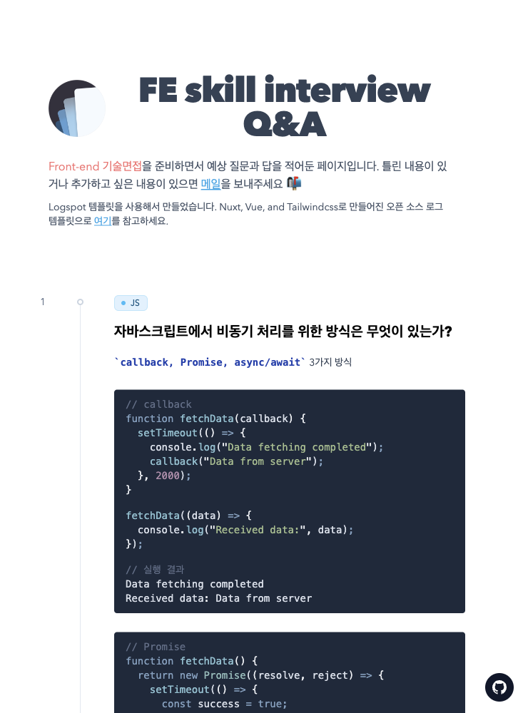

프론트 엔드 기술 면접을 준비하면서 예상 질문과 답을 찾아보고 생각해보고 적어보았다.
메모장에 적어보다가 공유해볼까 하고 페이지로 만들어봤다.
배포는 vercel을 사용했는데, 너무나 편하고 좋은것

[여기](https://logspot-eight-theta.vercel.app/)를 눌러서 확인해주세요 ✌🏻

템플릿은 Nuxt, Vue, and Tailwindcss로 만들어진 오픈 소스 로그 템플릿을 사용했다. 로그 템플릿이지만 내 맘대로 바꿔봄.

 
