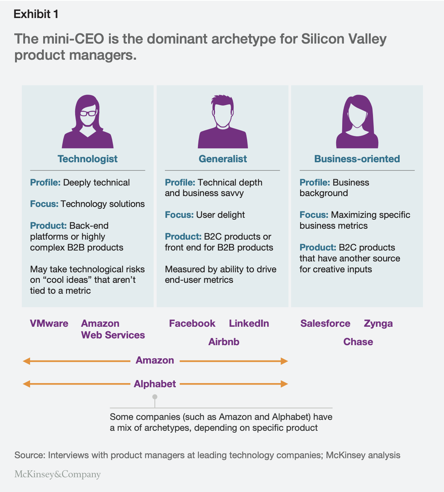

PM에 대한 여러가지 글을 찾아보면서 PM에 따라 강조하거나 그들이 관심사가 다른 것을 보면서 PM의 역할이 무척이나 다양하다고 생각했다. 내가 경험했던 PM은 기본적으로 `Project` manager 였고, 개발자로 오래 일하면서 자연스럽게 팀장이 되었고, 오랜 경험으로 기술에 대해 빠삭하여 설계부터 개발의 방향성을 잡아주고 코드 품질도 보는 경우가 많았다. 그래서인지 대부분 부장님이셨던 것 같다. 자연스럽게 나도 이러한 방향으로 PM이 된다고 생각했는데 개발자 출신이 아니거나 혹은 신입일 때부터 PM으로 일하는 사람들을 보면서 PM의 종류에 대해 찾아보다가 좋은 글을 발견했다.

## 디지털 세상을 위한 PM

[원문](https://www.mckinsey.com/industries/technology-media-and-telecommunications/our-insights/product-managers-for-the-digital-world#/)

 
글에서는 PM는 미니 CEO라고 한다. 여러 영역에서 일하고 전반적으로 다 알아야 한다는 말.
세 가지 전형에 대해 소개하는데, 그것은 technologists, generalists, and business-oriented 이다.

`Technologists`는 기술에 대해 깊이 알고, 기술적 문제해결을 중요하게 여긴다. 백엔드 플랫폼이나 복잡도가 높은 B2B 제품을 운영하고, 메트릭에 연결되지 않은 "멋진 아이디어"에 대한 기술적 위험을 감수할 수 있다.

`Generalists`는 기술적 깊이와 비즈니스 실제적 지식이 있으며, 사용자의 만족을 중요하게 여긴다. B2C 제품 또는 B2B 제품용 프론트엔드 서비스에 적합하며, 최종 사용자 메트릭을 구동하는 능력으로 측정된다.

위 두 종류의 PM이 사용자와 소통하는 방식에는 차이가 있다. Technologists는 업계 회의에서 다른 개발자와 이야기하거나 Hacker News를 읽는 데 시간을 보낼 수 있지만, Generalists는 일반적으로 고객 인터뷰, 영업 팀과 대화 또는 사용량 메트릭 검토에 시간을 보낸다.

 
마지막으로 `Business-oriented`는 사업 배경을 잘 아는 사람으로 특정 비즈니스 지표를 극대화 하는것에 초점을 맞춘다. 창의적인 입력을 위한 또 다른 소스가 있는 B2B 제품을 운영한다.

 

이러한 특징들을 봤을 때, 내가 익숙하고 추구하는 PM의 방향성을 찾게 됐다. 그동안의 공부했던 것과 경험을 비추어 볼 때, 나는 technologists와 generalists 사이에 있는데, Business-oriented를 추구하고 있는 중이다. 공익적 목적이 있는 서비스는 제외하고, 대부분의 서비스에서 기술적/사용자 친화적인 제품을 만드는게 당연하지만, 무엇보다 수익 창출이 가능한 서비스여야 오래갈 수 있고, 살아남을 수 있다.
