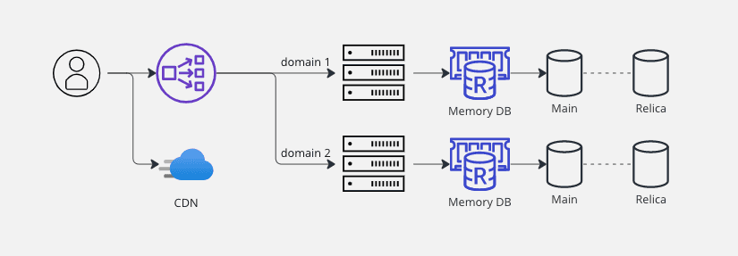

### 대규모 트래픽 처리가 필요한 경우

대규모 트래픽 처리가 필요한 경우를 생각해보면, 실시간 재고 관리가 필요한 서비스-예를 들어 쿠팡이나 네이버 쇼핑-나 결제 시스템, 혹은 유튜브같은 순간 접속자가 많은 경우 등이라고 유추할 수 있다. 네이버 메인 페이지의 트래픽 처리 글을 보면 사회적으로 주목 받는 일이 생겼을 때도 트래픽이 엄청나게 늘어나는데, 2017년 11월 포항에서 지진이 발생했을 때, 평소의 트래픽에서 30초만에 6배로 트래픽이 늘어나는 예시를 보여줬다. 이러한 서비스는 멈추거나 딜레이가 있을 때 사용자가 불편하게 느끼고 더 나아가 고객 이탈이 발생할 가능성이 높다.

대용량 트래픽 장애의 발생 원인은 많은 사용자가 동시에 많은 요청을 하기 때문이다. 요청이 많아졌다는 것은 트래픽이 높아졌다는 것. Request는 큐(Queue)를 통해 Thread pool에 할당되는데 Thread pool 사이즈를 초과하는 요청은 큐에서 대기한다. Thread는 시스템의 성능에 따라 사이즈가 결정되는데, 대량의 트래픽이 지속적으로 발생하면 서버의 지연시간은 늘어나고, 타임아웃이 발생하기도 한다.

<em style="font-size: 12px;">이미지 출처 adservio [(링크)](https://www.adservio.fr/post/tomcat-performance-best-practices)</em>

  

### 대용량 트래픽을 처리하는 방법

#### 스케일 아웃과 스케일 업

서버를 안정적으로 운영하려면, 큐에 쌓이는 요청을 빠르게 처리해주면 된다. 서버의 처리 능력을 향상시키는 방법으로 대체로 두 가지 방법을 추천한다. 스케일 아웃과 스케일 업이 있다. 두 가지는 각각 특성이 있으며 상호 보완적이다. 스케일 업은 서버 자체의 성능을 높여 처리 능력을 향상하는 것으로 기존의 서버를 보다 높은 사양으로 업그레이드 하는 것을 말한다. 하나의 서버에 디스크를 추가하거나 CPU나 메모리를 업그레이드 시킨다. 하나의 서버의 능력을 증강하기 때문에 수직 스케일링(Vertical scaling)이라고도 한다.

스케일 아웃은 접속된 서버의 대수를 늘려 처리 능력을 향상하는 것이다. 서버 팜(server farm)으로 사용되는 랙 마운트 서버군에 서버를 추가하는 것이나 블레이드 서버(blade server)에 블레이드를 추가하는 것 등이 전형적이다. 동시에 처리할 수 있는 데이터 용량이 증가할 뿐만 아니라 기존 서버의 부하를 분담해 성능 향상 효과도 기대할 수 있다. 서버를 추가 확장하는 것으로 수평 스케일링(Horizontal scaling)이라고도 한다. 다만, 스케일 아웃을 하는 경우 시스템의 복잡해지기 때문에 관리 비용이나 운영 이슈가 높다.

여러개의 서버를 사용하고, 모든 요청의 처리 시간이 다르기 때문에 요청의 배분이 중요한데, 이 문제를 해결하기 위한 기술이 `로드밸런싱`이다. 남은 큐의 크기와 이미 축적된 요청들의 예상 처리 시간을 고려해 요청들을 최적으로 분배하여 특정 서버에만 부하가 가중되는 것을 방지한다. 일반적인 분산 처리 모델이 이에 해당한다. 클라이언트 - 로드밸런서 - 서버(웹서버 - WAS) - 데이터베이스 구조

#### 캐싱을 통한 DB 부하 분담

서비스에서 공통된 데이터를 지속적으로 사용자에게 제공하는 경우가 있다. 사용자에게 필요한 공통된 정보를 제공하기 위해 매번 DB 에 접근해 데이터를 조회하는 것은 데이터 베이스 서버의 리소스를 낭비하는 것이며 서버 전체 성능에도 악영향을 줄 수 있다. 이 때 자주 사용 되는 데이터를 임시로 캐시 서버에 저장해 제공하는 방법을 고려해야 한다. WAS 와 데이터베이스 사이에 Memory DB를 두는데, Redis를 많이 사용하는 추세로 알고 있다. 메모리를 사용해 데이터베이스 데이터를 캐시 하게 되면 엄청 빠른 속도로 조회되는 것을 경험할 수 있다. 데이터베이스의 모든 데이터를 캐시하면 효율이 떨어지기 떄문에, 최대한 hits 가 많이 생길 수 있도록 자주 조회되는 데이터를 캐시하는 것이 효율적이다.

#### CDN

서비스를 운영하다 보면 정적 파일을 제공하는 경우가 많다. 프론트엔드 코드 파일이나 이미지 파일 등 정적파일이 이에 해당한다. 정적 파일은 반드시 WAS에서 제공해야 하는 것은 아니기 때문에, 서버 트래픽의 부담을 줄어주기 위해 정적 파일은 AWS의 cloudfront등을 이용해 CDN을 통해 서비스할 수 있다.

`콘텐츠 전송 네트워크(CDN)`는 데이터 사용량이 많은 애플리케이션의 웹 페이지 로드 속도를 높이는 상호 연결된 서버 네트워크이다. 콘텐츠 전송 네트워크(CDN)는 정적 콘텐츠뿐만 아니라 동적 콘텐츠도 전송할 수 있다. CDN은 위치와 캐시에 의해서 성능이 좌우된다.

GCDN(Global CDN)은 전 세계 거점에 위치한 캐시 서버를 이용하는 것인데, GCDN에서 지원하는 GSLB(Global Server LB) 기능은 접속한 IP 주소에서 가장 가까운 CDN 서버를 자동으로 선정해 연결하기 때문에 사용자가 빠른 서비스 속도를 체감할 수 있다.

#### 마이크로서비스

서비스가 많아지면서 WAS만으로 데이터 처리가 부담스러울 수 있는데, 이 때 Micro Service Architecture를 도입할 수 있다. `마이크로서비스`(또는 마이크로 서비스 아키텍처)는 단일 애플리케이션이 다수의 느슨하게 결합되고 독립적으로 배치 가능한 마이크로 단위의 구성요소 또는 서비스로 구성되는 클라우드 네이티브 아키텍처 접근 방식이다. 하위 도메인이나 서비스별로 서버를 분리하고 각 서버는 본인의 DB만 사용하게 할 수 있다. API를 통해 서로 통신한다. 단일 모듈의 장애에 전체 어플리케이션이 크게 영향을 받지 않고, 각 개별 서비스에서 새로운 기술 스택을 시험하고자 할 때, 의존 관계가 적기 때문에 바로 시작할 수 있다. 배포가 편하고 새로 조인한 개발자가 기능을 더 쉽게 이해할 수 있는 것도 장점이다. 단점은 각 모듈간의 인터페이스 처리가 복잡하고, 다른 서비스 중 하나가 응답하지 않게 될 경우에 방어코드를 작성해야 한다.

<em style="font-size: 12px;">이미지 출처 [(대용량 트래픽 처리를 위한 대규모 시스템 설계하기)](https://kyungyeon.dev/posts/96)</em>
  

추가로 `데이터베이스 최적화, 서킷 브레이커, 서비스 디스커버리, 성능 지표 수집과 모니터링 체계, 비상 대응 체계` 등을 도입하여 대규모 트래픽을 처리할 때 장애 발생을 줄이고, 최적화 하는데 도움이 된다. (기회가 되면 자세히 적어보도록 할 예정)

대규모 트래픽이란, 서비스의 규모나 종류에 따라 달라질 수 있으나 대체로 초당 수백, 수천, 수만 개의 요청이 동시에 발생하는 경우를 의미한다고 본다.
찾다보니 위에서 나열한대로 대규모 트래픽을 처리하는 여러가지 기술이 있는데 기본적으로 서버의 하드웨어적인 성능을 업그레이드하고, 분산 처리를 하는 것이 기본적이다. 이후 캐싱은 필수적으로 적용하고 서비스에 따라 CDN과 MSA를 선택적으로 적용한다. 기술을 추가할수록 설계의 복잡도가 증가할수록 관리 포인트가 늘어나기 때문에, 당연한 말이지만 충분한 기술 스터디를 거친 후 프로젝트나 회사에 맞게 시스템 아키텍처를 설계해야 한다.

 

참조 
[(스프링 대용량 트래픽 처리)](https://www.nextree.io/seupeuring-daeyongryang-teuraepig-ceori/) 
[(네이버 메인 페이지의 트래픽 처리)](https://d2.naver.com/helloworld/6070967) 
[(대규모 트래픽 처리)](https://velog.io/@yaaloo/대규모-트래픽-처리) 
[(Global CDN 가이드)](https://guide-gov.ncloud-docs.com/docs/networking-networking-7-1) 
[(CDN이란 무엇인가요?)](https://aws.amazon.com/ko/what-is/cdn/) 
[(마이크로서비스가 기업에 제공하는 유용성)](https://www.ibm.com/kr-ko/topics/microservices) 
[(오늘의집 MSA Phase 1. 백엔드 분리작업)](https://www.bucketplace.com/post/2022-01-14-%EC%98%A4%EB%8A%98%EC%9D%98%EC%A7%91-msa-phase-1-%EB%B0%B1%EC%97%94%EB%93%9C-%EB%B6%84%EB%A6%AC%EC%9E%91%EC%97%85/) 
[(Scaling to 100k Users)](https://alexpareto.com/scalability/systems/2020/02/03/scaling-100k.html)
[(번역)](https://leonkim.dev/systems/scaling-100k/) 
