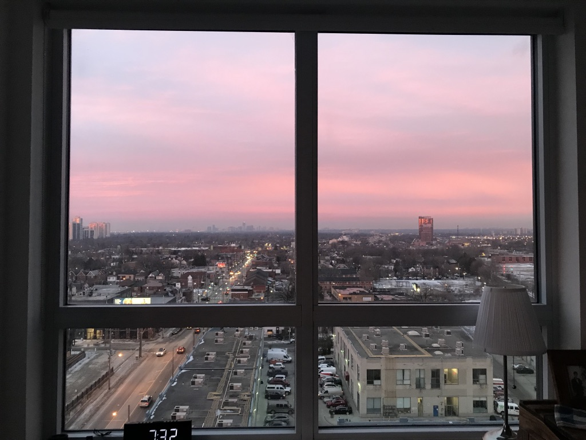
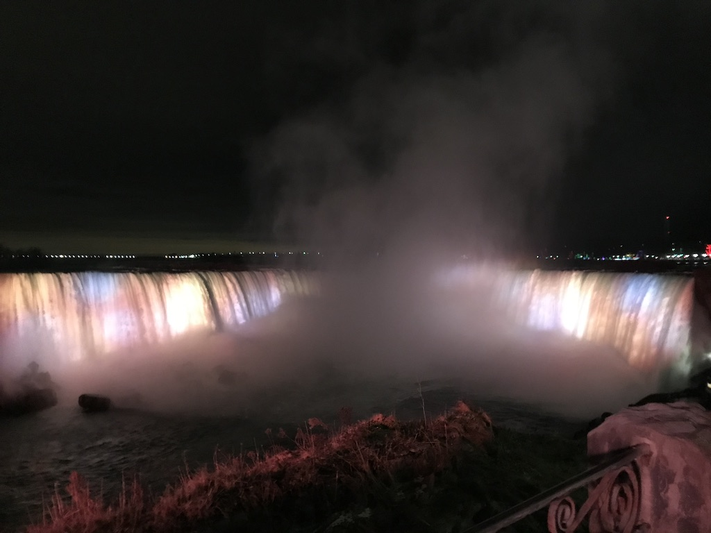
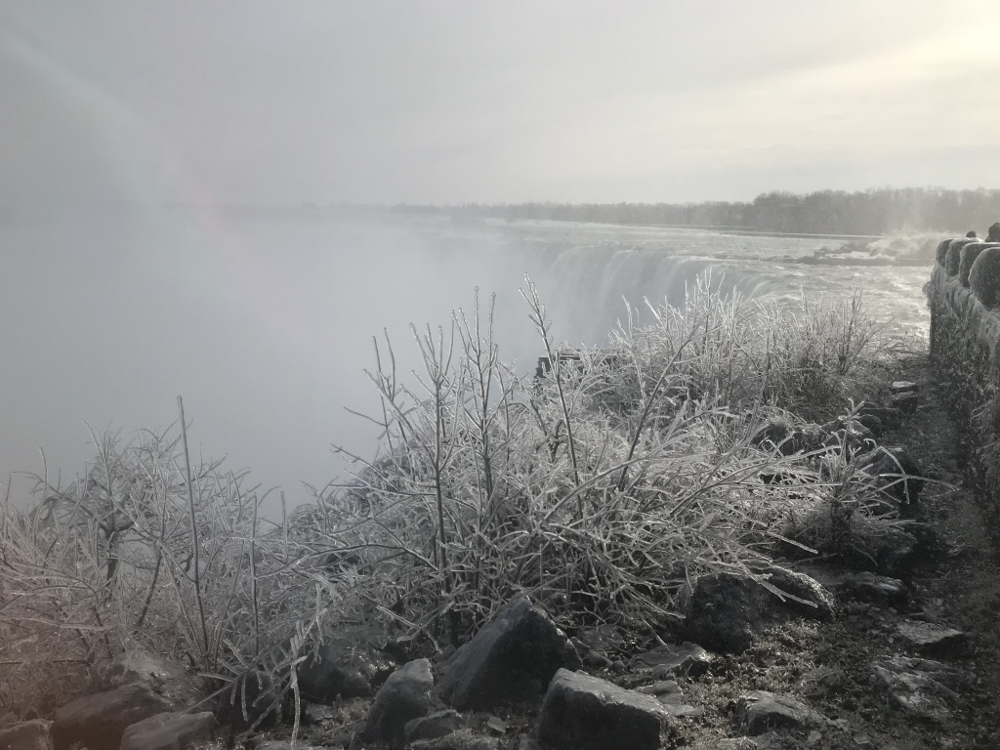

🇨🇦 토론토에 살게 된지 6개월이 되어간다. 2018년 12월 5일에 도착한 이후로 시간이 아주 아주 빠르게 지났다.
그런데 그 모든 일들이 일이난 시간이 단지 겨울 동안이었다.
겨울이 어찌나 긴지, 자꾸만 '빼앗긴 들에도 봄은 오는가' 시가 떠오를 지경이었다.
빠르게 지나간 시간 속에서, 집을 구하고(지금의 집을 구하기 전에 air bnb에서 한 달, 배출러에서 한 달을 보냈다.) 교회에 적응을 하고 
잠시동안 language school도 다녔었고, 캘거리로 출장+여행도 다녀왔다.
이 일상 사이사이에 곳곳에서 좋은 사람들을 만난건 아주 특별한 일들이었다.
새로운 곳에 적응을 하고 친구를 사귀는, 그 일들이 아주 오래된 일들처럼 느껴지는데 벌써 많은 시간이 흘렀다니, 
세월이 얼마나 빠른지 느끼게 되는 나이가 된 것만 같아 기분이 이상하다. 

  

☀️ 여기와서 제일 좋은 점은 자주 하늘을 본다는 것이다. ~~하늘밖에 볼 게 없기도 하다.~~ 
하루는 아침에 눈을 떴는데 하늘 이 모양. 핑크색 하늘이라니 인스타그램에서나 보던 하늘이 눈 앞에 펼쳐져 있어서 눈을 뗄 수가 없었다.

집이 서쪽이라 날이 좋으면 아름다운 석양을 볼 수 있는 기회가 많았는데, 
그 때마다 찍은 사진이 너무 많아서 사진첩에 따로 폴더를 만들어뒀다.
나중에 그리운 날이 오게 되면 보려고.

  

🚗 캐나다 사람들은 일 년에 두 번 쇼핑을 한다는 우스겟 소리가 있는데, 바로 Thanksgiving day와 `Boxing day`이다. 
이 곳에 도착한 달이 12월이라 박싱데이를 경험할 수 있었는데, 그 때 놓쳤던 세일을 벌써부터 기다리고 있는 중이다.
특히 전자기기라든가 전자기기라든가. (커피 머신 사고싶다.) 
Anyway, 작년 박싱데이를 맞이하여 연말이기도 해서 가는 길에 아울렛에서 쇼핑도 하고 나이아가라 폭포로 1박 2일 짧은 여행을 다녀왔다. 
박싱데이 말만 들었었지, 막상 아울렛에 가니 할인율이 엄청난 것. 우리 부부도 조금씩 이것저것 사재낀 것들로 이번 겨울을 잘 보낼 수 있었다.
쇼핑 넘나 좋은 것. 그리고 나서 도착한 나이아가라 폭포는 어마어마하였다. 밤 시간에 도착해서 다음 날 제대로 보고, 당일은 잠시 구경만 하고 오자 했던게 너무 예뻐서 폭포 끝까지 보고 돌아왔었다. 다음날 갔을 때는 폭포 근처에 얼어있던 나뭇가지들도 볼 수 있었는데, 빛에 반사되서 반짝반짝 하던 모습을 사진으로 담을 수 없어 너무 아쉬웠다. 겨울 나이아가라도 너무 매력적이었다. 매 계절마다 가기로 마음 먹었는데, 벌써 여름이 코앞이네.

