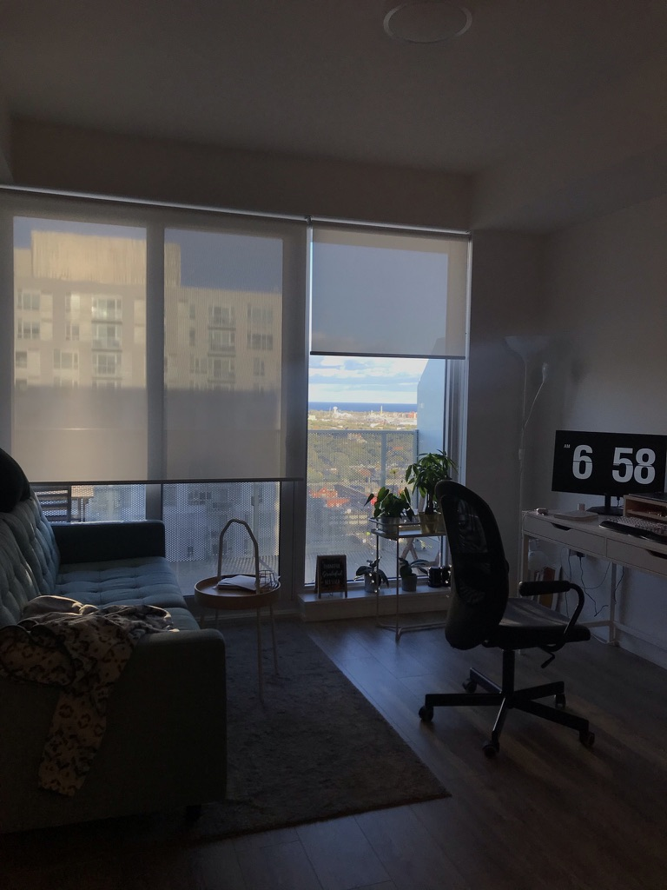

2월에 쓰기 시작했는데 지금 10월이라니. 반성한다. 아에 잊고 있던 일이다. 지금은 마음에 드는 그 집으로 이사와 벌써 반 년을 넘게 살았네. 이사할 때 생각하니 또 아주 우여곡절이 많았지만 기억나는대로 다시 써본다.

 

그 때 마음에 들었던 집을 거절 당하고, 처음부터 다시 시작하는 마음으로 (아 월세 구하는 것도 이렇게 빡쎘는데 나중에 집은 어떻게 사. 한국이 편하다. 아주 여러모로.) 캐스모에서 댓글 달아주셨던 다른 리얼터 분께 연락을 드렸다. 바로 통화하면서 사정 설명했고 같이 찾아보자고 하셨다. 통화로는 넘나 마음이 열리는 분이라 모든 설명 전화로 바로 다 오픈함. 그리고 두 군데 정도 쇼잉을 하러 갔다. 한 곳은 Parliament 라인의 완전 다운타운인 곳인데, 그 곳 역시 새 집이고 위치가 좋았는데 좀 좁은 감이 있었다. 오히려 덴이 좀 커서 덴을 침실로 쓰고 큰 방을 주로 생활하는 공간으로 쓸까 생각했는데 부엌이 너무 좁았다. 그래도 나는 채광이 좋고 새 집이라 이 집이 마음에 들었음. 그리고 다른 곳도 역시 다운타운이고 로저스 센터 근처 였는데, 몇 년 된 곳이고 무엇보다 내부가 엄청 넓고 10명은 앉아도 될만큼 큰 아일랜드 식탁이 있었다. 남편이는 여기가 마음이 쏙 든다 했다. 그러나 결국 내 마음대로 고고. 팔리아먼트에 지원서 넣어달라했고 리얼터님이 넣어주심. 다음날 그럼에도 또 리얼터 사이트 기웃기웃. 그러다가 저번에 완전 마음에 들었으나 거절당한 콘도의 25층 집이 나온것. 게다가 외국인도 환영이라해서 리얼터님한테 바로 연락해서 바꿀수 있냐 했지만, 오퍼 넣고 24시간 동안 기다리는게 좋다고 하셨다. 그쪽에서 그리고 오케이 하면 그집으로 가야한다고 하셨고.. 마음이 완전 쿵쾅쿵쾅. 근데 그 쪽에서 내가 다니는 회사 정보를 더 요구했다 한다. 근데 내가 다른집이 마음에 든다 하니 리얼터님이 줄 정보 없다고 해주시겠다 하면 아마 거절할거라고 하지만 혹시 모르니 기다려보자고 하셨고, 하루를 열심히 대기탔다. 결국 거절당했고 (거절 당하고 기쁜건 난생 처음) 마음에 들었던 콘도 바로 쇼잉하고 지원했다.

 

현재 집 위치는 Cabbage town 근처인데 아슬아슬하게 다운타운에 걸치는 영역인듯하다. 걸어서 20분 거리에 이튼센터 있고, 다른쪽 20분 거리에 디스트릭스 있다. 아쉬운 점은 그 때 봤던 집이랑 크기 구조는 똑같은데 뷰가 반대쪽이라 건너편 콘도가 뷰를 막는다는 것. 그래도 집이 너무 마음에 들어 계약했지 뭐야. 깨끗하고 1+1인데 다른집에 비해 넓고, 히팅+에어컨 포함, 글고 발코니가 짱 넓다. 여기에 고기 구워먹는 그릴이랑 테이블 의자 세트 구비해놔서 여름에 커피도 마시고 고기두 구워먹고 아주 알차게 사용했다.

 

다행스럽게도 집주인 분이 너무 좋으셨고 지금까지도 관계가 너무 좋다. 캐나다에서 나는 진짜 친절한 사람 많이 만남. 캐나다 사람 최고 친절함. 아 집주인 만날 때 계약하면서 1년치 체크를 전달해줘야해서 은행가서 체크를 신청했다. 얼만지 기억 안나는데 체크를 신청하면 30장인가 묶음을 주는데 이것도 30불인가 50불인가 돈 내고 받을 수 있다. 걸리는 시간도 일주일. 캐나다는 아직도 아날로그 적인게 아주 많은데 나는 왜 계좌이체를 안쓰고 체크를 쓰나 이해가 안되는 점이지만 이게 안전하다고 생각한다나.

 

그리고 3월보다 15일 일찍 2/15일에 이 집으로 이사왔다. 이사도 난리도 아니었는데, 미리 엘레베이터 부킹을 하지 않음 점이 아주 모든 원흉의 근원이었지. 꼭 이사가기전에 1,2주 전에 미리미리 하시길. 그 이후로는 이케아 3,4번 가서 물건 사고 배송하고. 집에 이미 큰 물건들 냉장고랑 아일랜드 식탁, 하이라이터, 전자레인지, 세탁기 건조기, 옷장은 기본으로 있어서 신혼 살림 살 때처럼 가전에 돈 쓸 일이 없어서 다행이었다. 크게 크게 침대 매트리스, 소파, 책상 정도 + 그 외 정도라서 3000불 정도 안에 해결 했던 것 같다. 이번엔 새롭게 다 준비한거라 재밌었다. 신혼집 들어갈 때 샀던 예쁜 쓰레기들을 사지 않을 수 있었다.

 

 

이사할 때쯤에도 코로나 소식이 있었지만, 이런 사태가 될 줄은 몰랐지. 안 그래도 재택근무이긴 했지만, 더 나갈 일이 적어졌다. 그래서 마음에 드는 집으로 와서 너무 다행이라고 생각했던 시간들이 오래 이어졌다. 집의 소중함이란. 아무튼 타지에서 사는것이 참 쉽지가 않은데, 주절 주절 쓴 글이지만 누군가 참고해주면 좋을 듯 하다. 질문도 언제든지 보내주세요.
