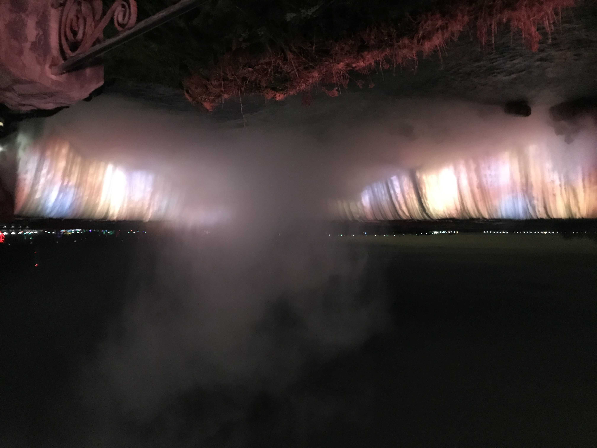
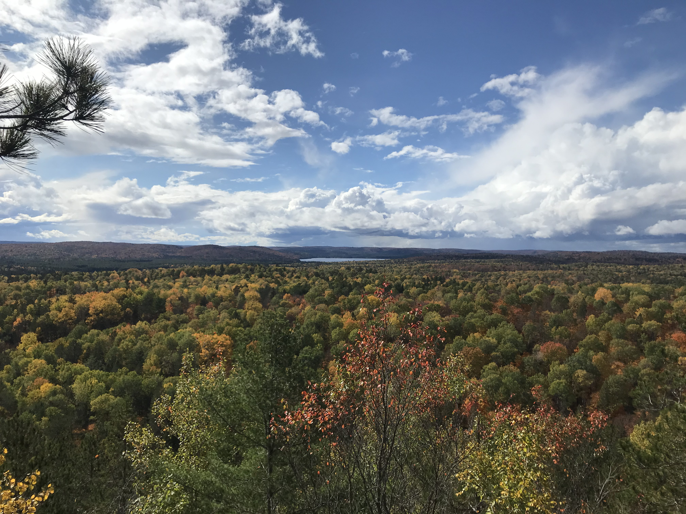
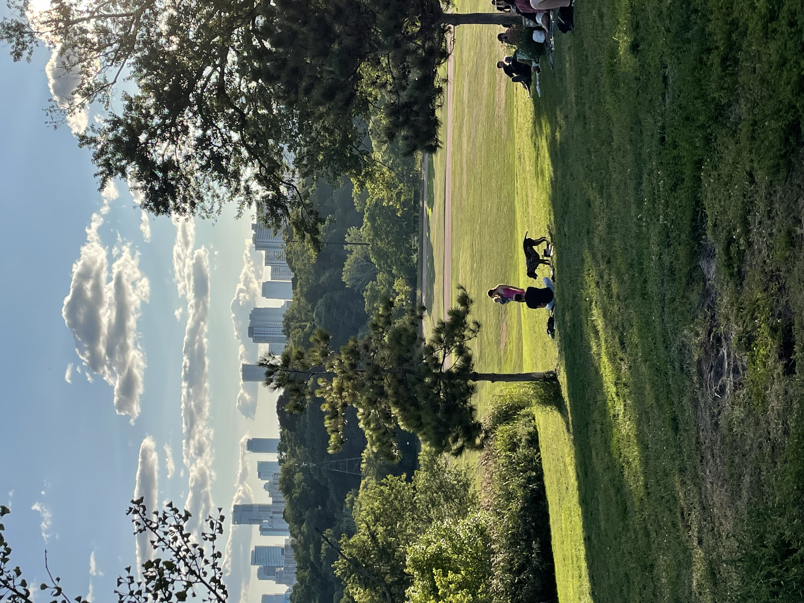
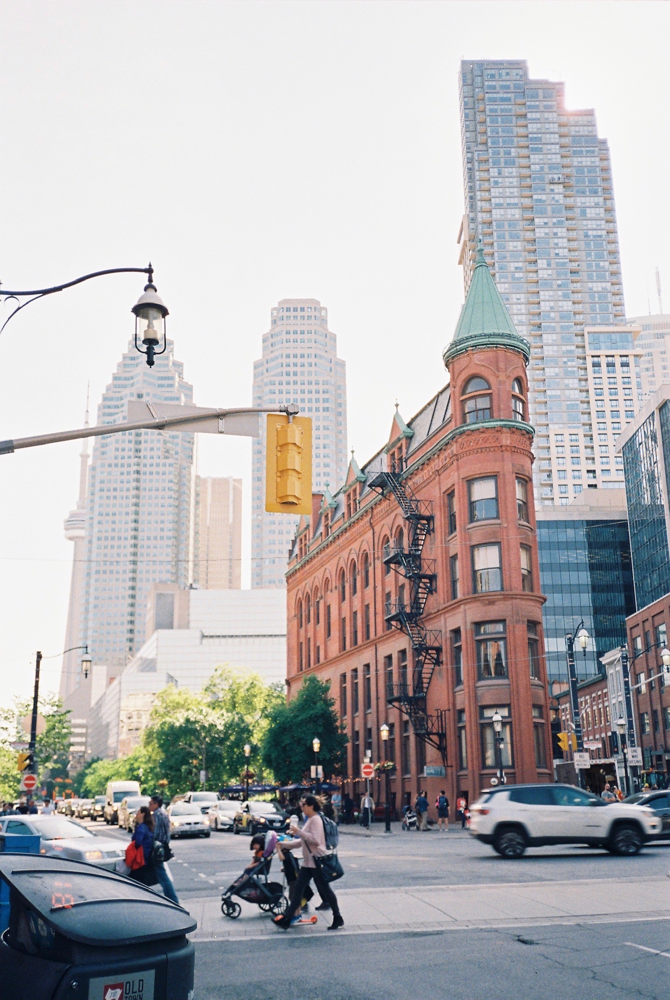
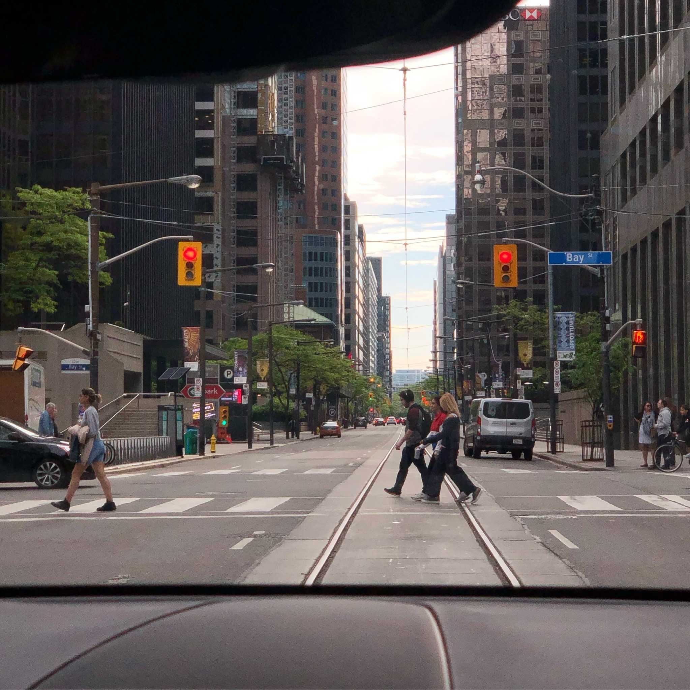

토론토에서 정말 많이 돌아다녔는데, 정작 블로그에는 병원 이야기밖에 없길래 작성하는 블로그 ㅎㅎ

  

가장 먼저 생각나는 곳은 Distillery district, 이사했던 집에서 가깝기도 해서 밥먹고 산책 겸 가기도하고 오전에 빵사러 가기도 하고, 도심 속 아름다운 곳이라 자주 갔었다. 그래도 가장 좋은 시기는 크리스마스 마켓이 열리는 겨울이지!

  

다음으로 생각나는 곳은 토론토는 나이아가라 폭포 무조건! 사진이랑 영상이 오조오억개 있지만 인터넷 찾아보면 엄청난 사진이 더 많으니까 하나만 ㅋㅋㅋㅋㅎㅎ 근데 진짜 배 타는거 강추, 봄여름가을겨울 언제 가든 좋음

  

알곤퀸도 빼놓을 수 없다. 가을되면 무조건 떠나야지. 괜히 단풍국이 아님. 너무 그리울 곳.

  

제일 많이 간 곳이 사실 Riverdale park, 여름에 테니스 치러 엄청 갔기 때문이지. 토론토에 많은 공원이 있지만 석양을 볼 수 있는 아주 아름다운 곳이다. 여름에는 번개도 잘 볼 수 있음 ㅋㅋㅋㅋ

  

하버프론트 근처 공원이랑 슈가비치!

  

세인트 로렌스 마켓을 가게되면 꼭 보고 오게 되는 gooderham 빌딩. 뉴욕에 있는 Flatiron 빌딩이랑 비슷한듯 다른듯

  

체력 저하로 급히 다운타운 횡단보도로 마무리. 나에게 시간적으로 너무나 여유로운 삶을 살게 해줬던 토론토. 좋은 친구를 만났던 곳. 행복한 여름과 기다림의 겨울을 배운 장소. 여러모로 추억이 가득한 곳이다 🥲🍁🙏😊🌇

