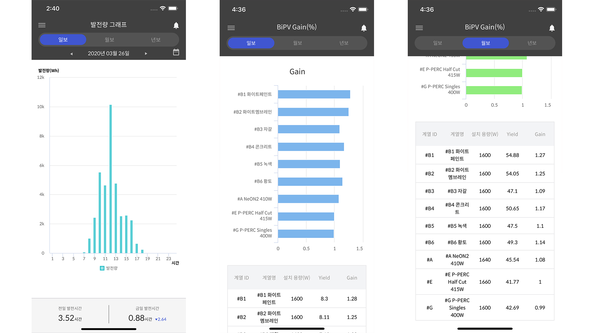
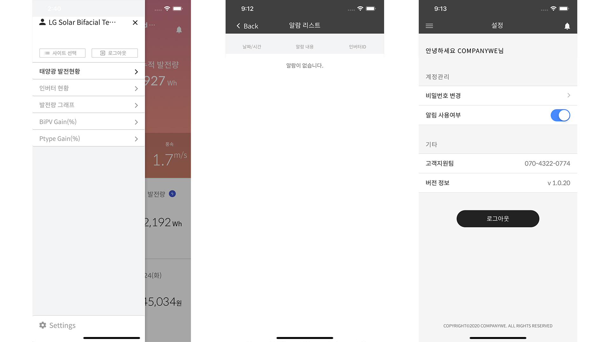

대표적인 화면들을 캡쳐해봤다. 이번 앱은 Solaredge라는 회사의 미터기 제품을 사용했을 때, 해당 미터기의 데이터를 API로 호출하여 실시간 데이터 값을 표시하고, 데이터를 이용하여 일간/월간/연간의 데이터를 사용하여 그래프와 테이블로 표시하였다.
기존에 회사에서 Angular typescript를 이용하여 만들었던 소스를 기반으로 적절하게 수정하였다. ionic과 cordova를 사용하였는데, 기본적인 앱의 기능이나 대시보드로 사용하기에는 접근하기 쉽고 문서도 잘 되어있어서 개발하기 수월하였다.
푸시는 onesignal을 이용하였다.   

유저가 미터기를 가지고 있는 사이트의 리스트를 불러오고, 그 중에 선택하면 해당 사이트의 정보가 나타난다. 5분 단위로 데이터를 갱신하였다.
  

일간/월간/연간의 합계 내역을 그래프와 테이블을 이용하여 한 눈에 들어올 수 있게 했다.
angular2-highcharts를 사용하였는데, 사용법이 간단하고 디자인이 괜찮았다.
  

  

> Copyright 2020. Companywe. All rights reserved.  
> 이곳의 모든 저작권은 컴퍼니위에게 있습니다. 이곳의 모든 사진들은 허가없이 사용할 수 없습니다.
