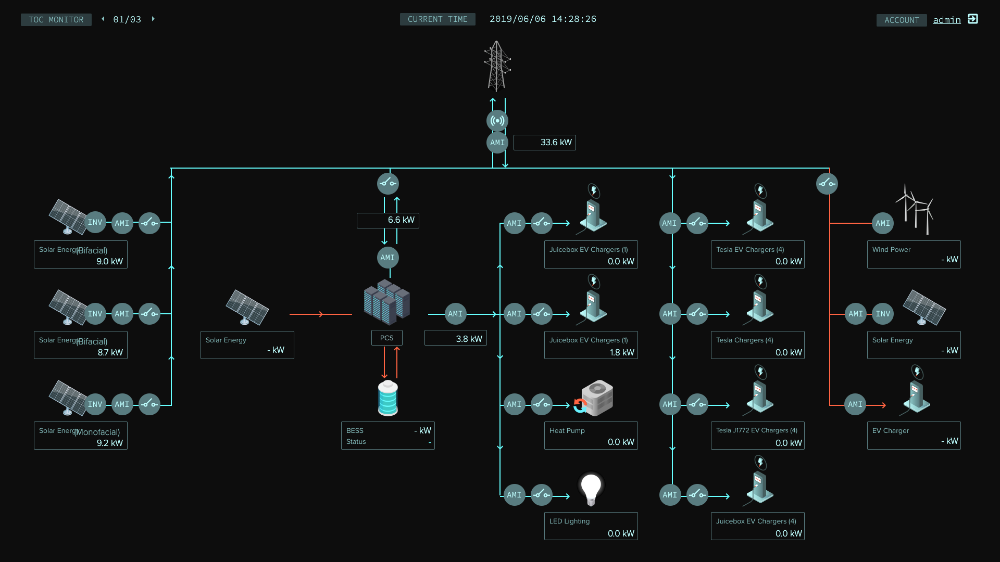
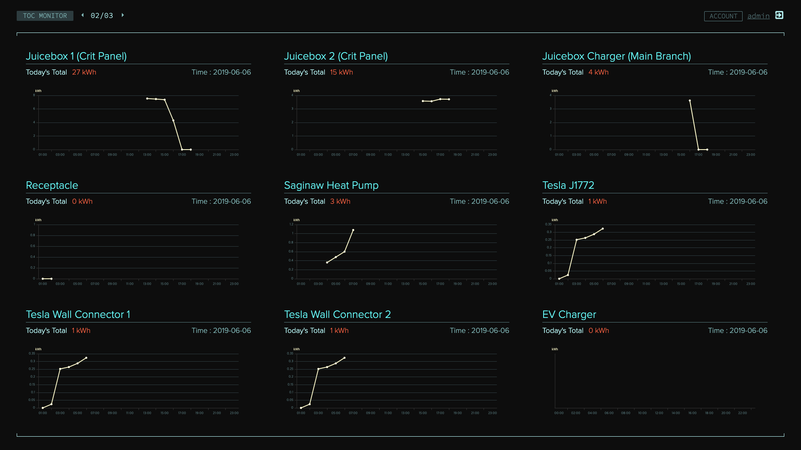
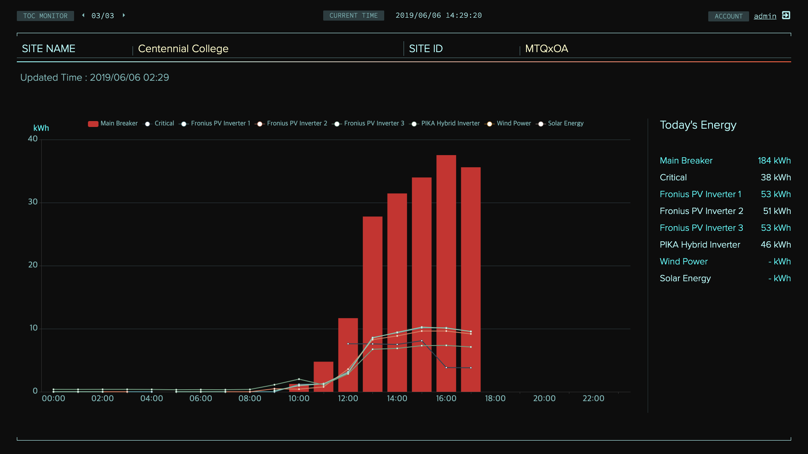

 

☀️ Summary  
캐나다 토론토에 있는 센테니얼 대학 주차장에 태양광을 이용한 쥬스박스와 테슬라의 전기차 충전 시설에 대한 실시간 사용량 모니터링 화면을 구현하였다.

🌱 Requirements  
관리자가 보는 3개의 전광판을 사용할 수 있어 3개의 화면이 필요함.
실시간 전력 흐름을 알고 싶음.
사용량을 알고 싶음.

✨ Solution  
설치된 충전 시설의 구조를 이미지화 하고, 젼력이 어떤 방향으로 흐르는지 화살표로 표시했고, 각 설비마다의 전력량을 표시했다.
실시간 값을 받아올 수 있게 소캣을 사용하여 구독형 방식으로 데이터를 받아 표시하였다.
관리자가 하루치의 전령 사용량을 확인하고 싶어하여 설비마다/전체 합산에 대해 하루치 전력 사용량을 그래프로 표시하였다.

💐 Performance  
고객의 요구사항이 반영될 수 있는 화면 설계와 프론트엔드 개발
   

  

> Copyright 2019. Companywe. All rights reserved.  
> 이곳의 모든 저작권은 컴퍼니위에게 있습니다. 이곳의 모든 사진들은 허가없이 사용할 수 없습니다.
