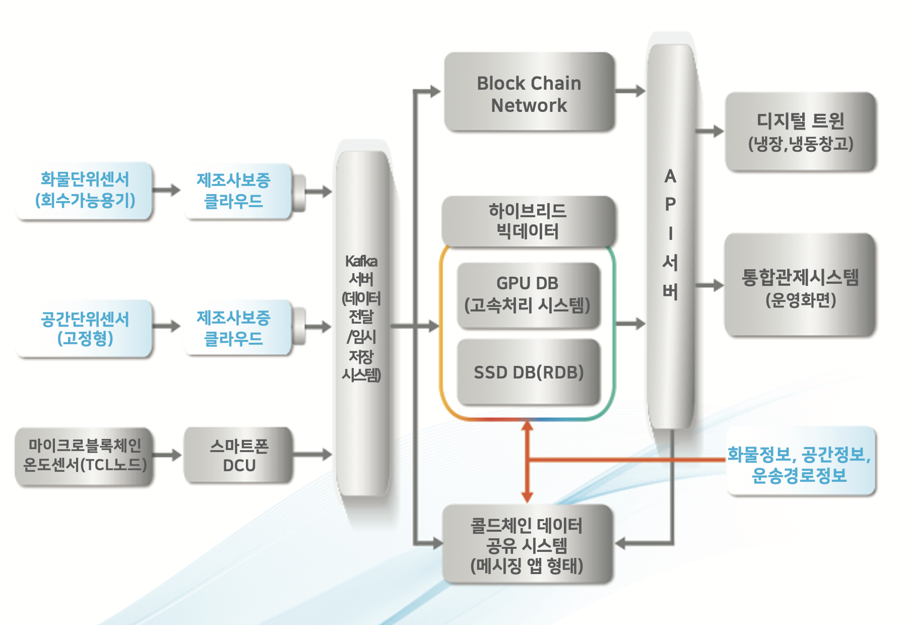

 

### 프로젝트 설명

국책과제에 참여하게 되었는데, 본 과제는 식품 및 바이오·의약품 공급망의 종단간(공급-제조-유통-고객) 상태정보의 실시간 모 니터링을 위한 블록체인 기반 TCL 플랫폼을 구축하는 연구다. 그 중에서 우리 회사는 블록체인 기반 데이터 플랫폼을 구성하는 역할을 담당하고 있다.
만들어야 하는 시스템은 총 3가지로 나눠진다.

1. TCL 전용 블록체인 네트워크 구축
2. 센서 데이터의 표준화 데이터베이스 구축 및 데이터 수집(배치 스케줄러, 자동화 도구)
3. 센서 디바이스 관리 프로그램

 

###### structure

 

이 중에 가장 중심 기능이 되는건 블록체인 네트워크 구축으로 현재도 진행중이다.
블록체인 플랫폼은 블록체인 기술을 활용한 데이터 분산저장 기능과 함께 사용자가 원하는 기능을 프로그래밍할 수 있는 스마트 컨트랙트, 외부에서 활용 가능한 DApp을 구현할 수 있는 기반 플랫폼으로 대표적으로 IBM의 하이퍼레저 패브릭, 카카오의 클레이튼과 같은 플랫폼이 활성화되고 있다.

그 중에 우리는 하이퍼렛져 프라이빗 블록체인을 선택했는데, 하이퍼렛져 프라이빗 블록체인은 허가된 주체만이 블록에 대한 조회 및 검증이 가능하고, 허가되지 않는 자는 블록 탐색기(Block explorer)로 조회할 수 없는 보안성이 있기 때문이다. 해당 네트워크를 구성하여 API를 통해 서비스를 제공하는 연구 주체로 데이터를 전달하게 된다.

 

블록체인 네트워크 개발과 동시에, 콜드체인 관제 시스템의 일종으로 관리자를 위한 센서 디바이스 관리 프로그램으로 모바일 어플리케이션을 개발하였다. 해당 블록체인 API로는 데이터 관리 플랫폼에도 적용 예정이다.

해당 프로그램은 장소를 기반으로 플레이스(예를 들어 물류센터)를 추가하고, 해당 플레이스에 멤버들을 초대, 추가하여 플레이스의 있는 센서들을 관리하는 앱이다.
물류센터에는 구역이 나눠져 있어, 플레이스 내에서도 구역을 추가할 수 있고, 구역마다 멤버와 센서 구성을 다르게 할 수 있다. 구역에 있는 멤버와 센서들은 플레이스에 자동 추가가 된다.
구역마다 채팅방이 형성되는데, 채팅방 내에서 챗봇을 이용하여 센서의 최신값을 알 수 있다.

 

### 역할

`기술 PM`으로 참여하고 있는데, 3년의 기간동안 진행되는 과제인 만큼 만들어야 하는 시스템의 규모도 크고 달성해야 하는 정량적 목표가 많아 일정 관리와 총괄 PM과 개발자들과의 합의하는 과정이 어려웠다. 제안한 내용대로 만들어야 하는 시스템은 명확했으나 어떤 기술로 어떤 결과물을 낼지는 정해진 부분이 아니라 팀원들 각자의 생각을 정리해서 회의하고, 다시 찾아보고 논의해서 결정하는 과정을 여러번 거쳐 목표 결과물을 설정했다.

`데이터베이스 설계`
가장 먼저 센서 데이터를 수집하는 부분에 시간을 많이 할애했다. 데이터를 수집해야 하는 센서의 종류가 다양하고 센서의 성격에 따라 수집할 수 있는 데이터의 내용과 형태, 방식 또한 다양해서 모든 정보를 저장할 수 있게 데이터베이스를 설계하고 데이터의 형식을 표준화 하는 부분이 까다로웠다.
예를 들어, 물류의 위치와 온도 데이터는 필수적으로 수집하나 필요에 따라서는 습도나 조도, 충격에 대한 정보가 필요한 경우가 있었다. 그리고 블루투스 통신 방식을 사용하는 센서도 있고, 어떤 센서는 LTE 또는 RF(Radio Frequency) 방식을 사용하기로 했다.
고민했던 부분은 다른 데이터의 내용을 모두 컬럼을 만들어 있으면 추가하고 없으면 null로 둘지, JSON 형태의 raw data로 저장할지 고민했는데, raw data 테이블로 모두 저장후에 다른 테이블에 데이터를 표준화해서 파싱하는 방식을 선택했다.
데이터베이스는 PostgreSQL을 기반으로하는 아마존의 레드시프트를 사용했다. 데이터가 계속해서 많아질 것을 생각해서 클라우드 기반이라 확장성이 뛰어낙 비정형 데이터도 분석할 수 있는 기능이 있어 선택했다.
데이터 수집은 센서 제조사의 클라우드에서 API 형태로 받거나, 스마트폰 DCU(Data collection unit)을 사용하는 경우는 구독형태로 Kafka 서버에서 받아 DB로 파싱하는 방식으로 진행했다.

`어플리케이션 개발`
크게 3종류의 어플리케이션을 개발 진행중이다. 하나는 블록체인 시스템과 API, 물류창고 관리자들을 위한 모바일 어플리케이션, 전체 데이터 관리를 하는 Thing's 플랫폼을 개발하고 있다.
블록체인은 SK C&C의 블록체인 플랫폼인 [ChainZ](https://chainzapi-skcc.gitbook.io/)의 구성을 참고했다.
