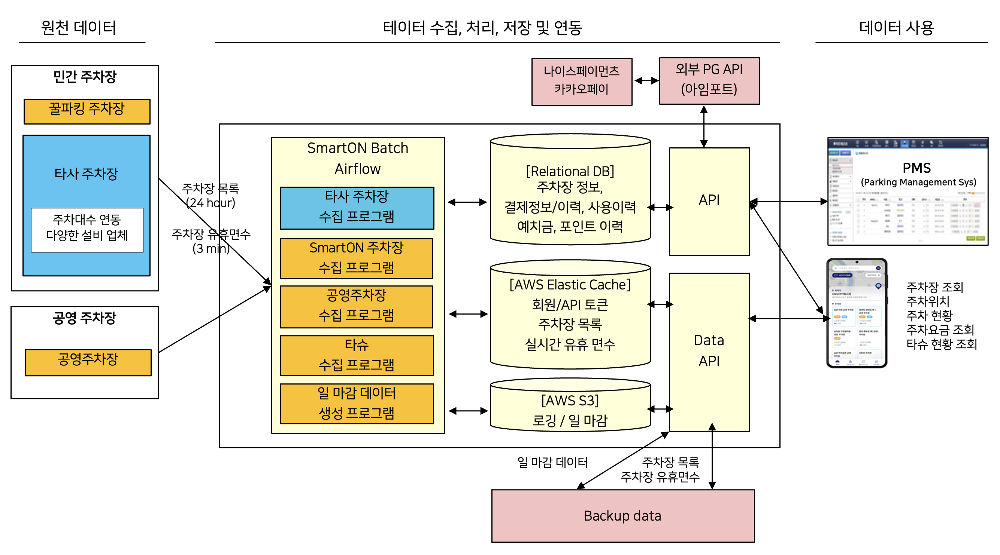

### Prologue

진짜 고생했던 프로젝트라 후기를 남긴다.
작년에 끝났어야 했던 프로젝트인데, 올 해 1월에 최종 종료 감리가 있어서 감리까지 CLEAR!
프로젝트 자체는 재밌는 아이템이라 재밌어야 했던 프로젝트지만, 너무 많은 이해관계자가 있어서 ㅋㅋㅋㅋ힘들었다.

총 기간 3년에 사업비 100억짜리 프로젝트였는데, 어쩌다보니 3년차에 기술PM으로 합류. 앞으로 개발 방향을 정해서 진행하며 된다는 말에 속아 발을 담갔다. 주차장 데이터는 처음 접했는데, 기본적인 골조는 다른 프로젝트와 많이 다르지는 않았다. 특성만 파악하고 나면 간단한 구조라고 생각했다. PG사를 정하는 것부터 결과 코드까지 다 만져볼 수 있었는데 가장 유저에게 예민하게 피드백이 오는 부분이라 연락 올때는 마음이 두근거리지만, 다음에는 이렇게 하면 좋겠다 같은 생각이 많이 드는 부분이었다. 짧은 시간에 적은 인력으로 진행하느라 빡쎘지만, 결과적으로는 좋은 경험이었다고 생각한다.

결과물로 나와야 하는 프로그램은 총 2가지로 주차와 관련된 앱 2가지인데 성격이 다른 앱이라 분리해서 진행했다.
메인은 `꿀파킹` 주차장 앱과 관리자 웹페이지, 다른 하나는 불법주정차 `파킹벨` 앱과 동일하게 관리자용 웹페이지였다.
불법주정차 쪽은 파트를 떼서 외주 업체가 맡아서 진행했고, 고객이 불법주정차 시 앱푸시나 카카오톡 알림, 문자 메시지로 알람을 받을 수 있는데, 그 때 근처 주차장 찾기 문구와 함께 꿀파킹 앱 연결 URL을 보내서 꿀파킹 앱과 연결할 수 있게 진행했다.

파킹벨 쪽은 외주업체에서 관리했기에, 집중적으로 담당했던 부분은 꿀파킹 쪽이었고 리스트를 적어보면 다음과 같다. 사실 이 내용 중 개발에 참여하는건 PM이 담당해야 하는 업무가 아니라 생각되었지만, 특수한 프로젝트 상황이었고, 프로젝트를 잘 진행하기 위해 한다 라는 마음으로 참여했다.

```
1. 타사의 데이터 수집 및 연계
2. 앱 결제대행사(PG사) 연동 및 에러사항 수정
3. 테스트
4. 데이터 관리를 위한 관리자 사이트 추가 개발
```

### Structure

대략적인 구조도는 이렇다. 관계형 데이터베이스에 모든 데이터를 다 넣었고, 실시간으로 필요한 데이터는 Amazon ElastiCache 서비스를 이용해 캐시에 저장하고, 데이터를 정리해서 DB에 저장하는 형태로 구성하였다.
주차서비스 도메인에서 가장 중요한건, 실시간 주차대수와 주차를 할 수 있는 유휴 면수, 입/출차와 주차 요금 결제다. 특히 입차를 인식하지 못하면 요금을 계산할 수 없고, 결제를 못하면 출차할 수 없는 등 입출차와 주차 요금은 실시간 이벤트가 발생하고 연결되어 있기 때문에 해당 이벤트의 처리와 에러 발생 원인에 대해 세밀하게 파악해야 했다.


주차차단기 업체가 여러개고, 주차대수를 파악하는 방법이 업체마다 다른데(카운팅 방법, 센서 인식 방법, 영상인식 방법 등) 결국 연동하는 입장에서는 데이터 프로토콜에 맞게 넣으면 되는 부분이다. 따라서 처음 설계 시 이 모든 가능성을 염두해두고 좋은 설계를 하면 참 좋다. (결국 수정하겠지만 ㅎㅎ) 그리고 아임포트를 이용해서 카드결제와 간편결제 연동을 했는데, 여러 에러들을 맞닥뜨려봐서 다음에 다른 프로젝트 진행 시 결제 쪽에 어떤 이벤트들이 발생할지 파악하기에 좋았다.

### 데이터 수집과 Airflow

앱은 React native를 사용했고, 웹페이지들은 Next.js를 사용했다. Next.js 후기는 다음에. 재밌었던 부분은 배치파일 쪽인데, 정해진 시간마다 데이터를 수집하는 배치파일들은 Python을 사용했다. 여기서 배치파일이 잘 돌고 있는지 확인하는 Airflow를 처음 접해봤는데 아파치에서 개발했고 Python 코드로 워크플로우(workflow)를 작성하고, 스케쥴링, 모니터링 하는 플랫폼이라고 한다. 각 Dag의 실시간 상태와 스케줄링을 한눈에 파악하기 좋고 화면에서 바로 코드도 볼 수 있다. 에러가 나면 해당 부분도 알려줘서 에러처리 시 편리했다.


[오늘의집 블로그, 버킷플레이스 Airflow 도입기](https://www.bucketplace.com/post/2021-04-13-%EB%B2%84%ED%82%B7%ED%94%8C%EB%A0%88%EC%9D%B4%EC%8A%A4-airflow-%EB%8F%84%EC%9E%85%EA%B8%B0/)에 정리가 잘되어있다.

### i'mport

아임포트가 사용하기 편한건 알고 있었는데, 오랜만에 다시 써보니 [API](https://portone.gitbook.io/docs/)들이 업데이트가 많이 되어있어서 진짜 편했다. 편의점방문 수납결제부터 에스크로 결제건 등 엄청 확장되어 있었다. 관리자 페이지도 편리해서 정산 하는 부분은 아임포트 API 사용해서 커스텀하면 되니까 쉽게 구성 가능해보였다. (범위가 아니라 이부분은 안함) 우리는 웹훅을 연동해서 사용했는데, 웹훅이란 특정 이벤트 발생 시 알림을 보내주는 기능이다. 알림을 이용해서 우리 DB에 필요한 데이터를 저장했다.

### VPN

해당 프로젝트는 가상 사설망으로 구축되어 있어서 DB 접근이나 Airflow, API 등 프로젝트에 접근시에는 VPN을 사용해서 접근해야 했는데, OpenVPN을 사용해서 각 사용자별로 프로파일을 주고 접속할 수 있게 했다. 그래서 어디서든 업무 가능했던 점은 장점. 다만, 보안툴 사용해서 사용자들의 접속 기록을 볼 수 있다고 알고 있는데, 모니터링이 목적이기보단 보안이 목적인 것으로 생각해야지.

### 감리

국토부 과제라 매년 시작/종료 감리가 있고, 3차년도에는 앱 테스트 감리도 있었다. 감리 시작 전에 감리설명서를 주고 그에 맞게 준비하는 기간을 준다. 그리고 일주일정도 감리를 진행하는데, 감리위원들이 있는 장소로 가서 자료 제출하고 설명하고 하는 식이다. 해당 기간에 고칠 수 있는 부분들은 수정하거나 기간이 걸리는 일은 감리 결과에 보완하라고 써주면, 감리 종료 후 한 달 정도 기간동안 수정해서 제출한다.

감리를 진행하면서 느낀점은 프로젝트 문서화가 중요하고 이렇게 하면 인수인계 기간이 짧아지고 효율적일 수 있다고 생각이 들긴 하지만, 프로젝트보다 문서 자체가 중요한 거 같다는 생각이다. ㅋㅋㅋ 그래서 감리할 때는 사람이 삐딱해진다고 해야할까.

그리고, 감리 방식이 너무 올드스쿨이다. 08학번인데 그때도 소프트웨어 공학 배우면서 올드하다고 생각했던 방법을 여전히 적용하시는 감리위원도 있고.. 감리위원분들이 대체로 오랜 회사 생활 이후 은퇴하시고 하는 경우가 많아서 그렇겠지만, 젊은 감리업체들이 있었으면 한다.

### 마무리

프로젝트하면서 답답할 때도 많았는데, 마무리가 되어서 다행이다. 아쉬운 점들이 많은데, 다음에는 처음부터 프로젝트에 투입해서 설계부터 같이 하면 참 좋겠다는 게 첫번째 아쉬운 점이고, 다른 아쉬운 점은 개선하는 부분까지 프로젝트에 투입해보고 싶다는 거다. 이런 과제 용도말고 사기업에서 플젝을 맡아보면 그렇게 할 수 있겠지! 많이 배웠다.
