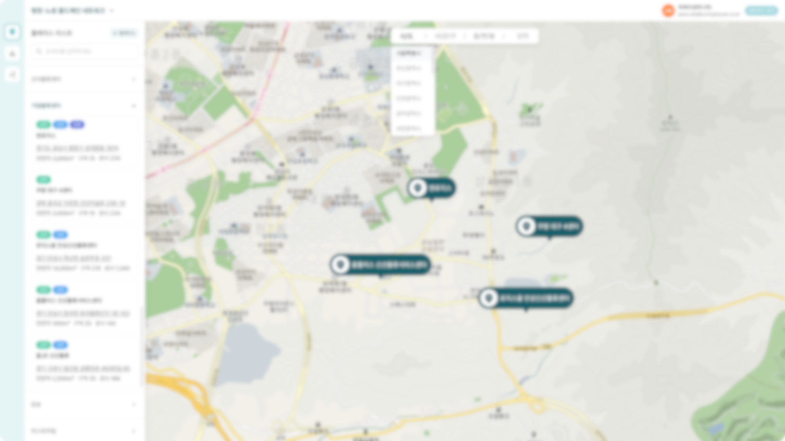

☀️ Summary  
콜드체인 과제의 연장으로 콜드체인을 실행하는 다양한 업체와 각 업체가 사용하는 다양한 센서의 데이터를 관리하고, 블록체인 기술을 이용하여 데이터의 위변조를 불가하게 하는 시스템 개발

🌱 Requirements  

- 블록체인 기술을 활용하여 데이터 무결성 유지 및 데이터 처리 속도가 높아야 함
- 블록체인 데이터 검증 필요
- 센서의 위치를 표시하고 각 센서의 스펙 정보 조회
- 각 센서의 Raw 데이터를 보고 싶음
- 센서가 이상이 있는 경우 경고(Alert) 기능
- 원하는 정보를 조회하고 싶음, 예를 들어, A 센서의 이번달 B 데이터의 합

✨ Solution  

- 센서 데이터만 블록체인에 저장하고, 나머지 데이터는 off chain에 포함하도록 설계
- 데이터 처리 속도를 초당 2000TPS를 목표로 하여, 채널을 병렬화 하여 20개의 채널을 만들기로 설계
- 트랜잭션 단위를 (1) 모든 데이터 하나하나 (2) 전처리과정을 거친 데이터 (3)각 센서별 해시트리로 할지 이 3가지를 설정해서 테스트 후, 가장 적합한 단위를 찾았다.
- 처리 속도를 높이기 위해 데이터 크기의 상한선을 1kb로 설정하여 이를 넘지 않는 데이터로 쪼개서 블럭을 만들었다.
- 지도를 이용하여 회사의 위치를 표시하고, 각 회사가 소유하고 있는 센서의 리스트와 각 센서의 스펙을 표시
- 시간순으로 센서의 데이터를 로그 형식으로 표시, 데이터가 매우 많기 때문에 무한 스크롤을 이용했다.
- 센서에서 일정시간 이상 데이터가 오지 않는 경우, 또는 평소 데이터보다 수치가 매우 다른 경우(수치의 이상 범위를 미리 설정해둠)를 심각/경계/주의/관심 등으로 세분화하여 경고 표시했다.
- 메뉴선택 형의 챗봇 형태를 이용하여 미리 유저가 필요할 만한 문구과 대답의 로직을 설정해뒀다.

💐 Performance  

- Technical leader
- 블록체인 기술 스터디 및 방향 설정
- RDB 데이터베이스 설계
- 외부 공유 용도의 API 설계
- 프론트엔드 개발
     

\*대표적인 페이지들이다. 대외비라 내용은 블러처리를 했다.  
